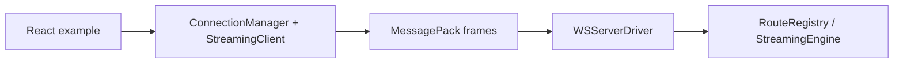
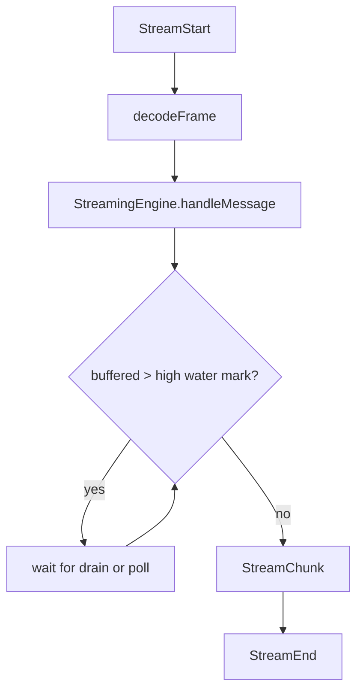
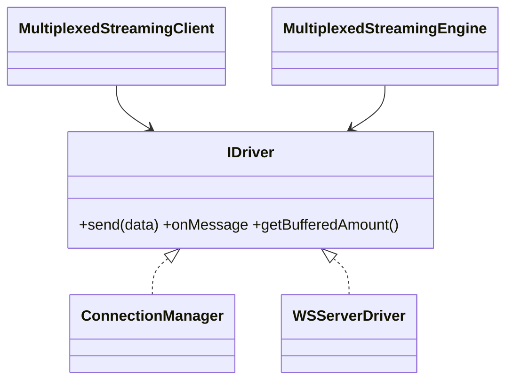
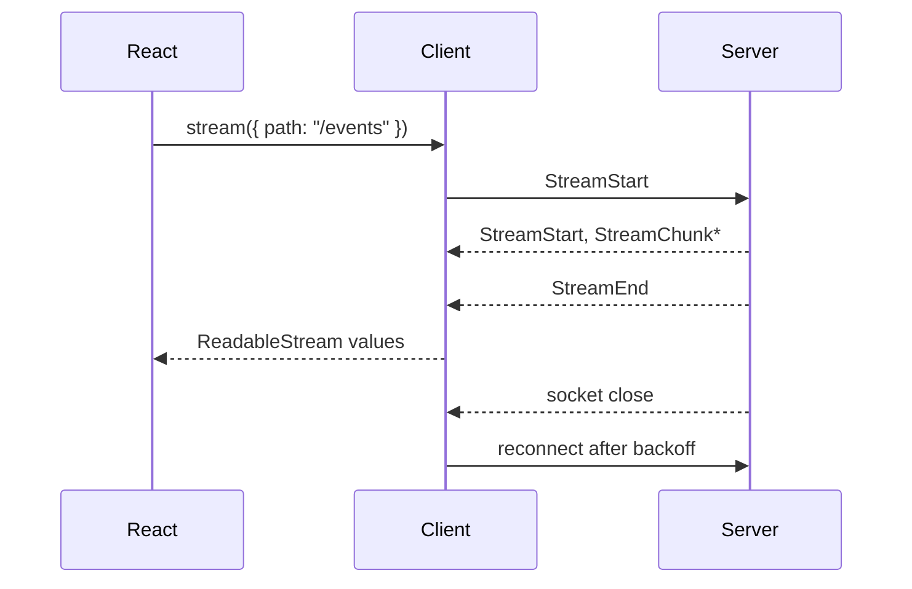

# E2E and release-readiness design

The E2E suite uses the public package entrypoints against an ephemeral `ws` server. Unary requests use the same six-field MessagePack frame contract as streaming requests; the example is a small React client paired with a real `@bxios/server` driver.

## High-level design

## Low-level design

## Class and interface relationships

## Request sequence

The suite is intentionally transport-level: it does not claim an unimplemented high-level REST adapter. `pnpm build` emits ESM, CommonJS, and declaration files for all publishable `@bxios/*` packages.
