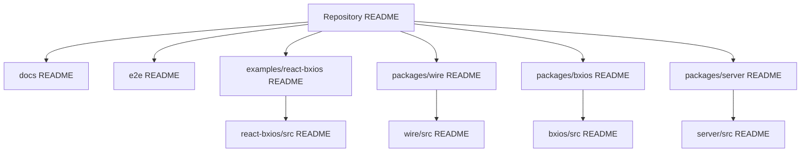
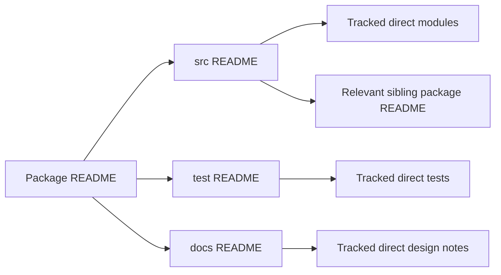
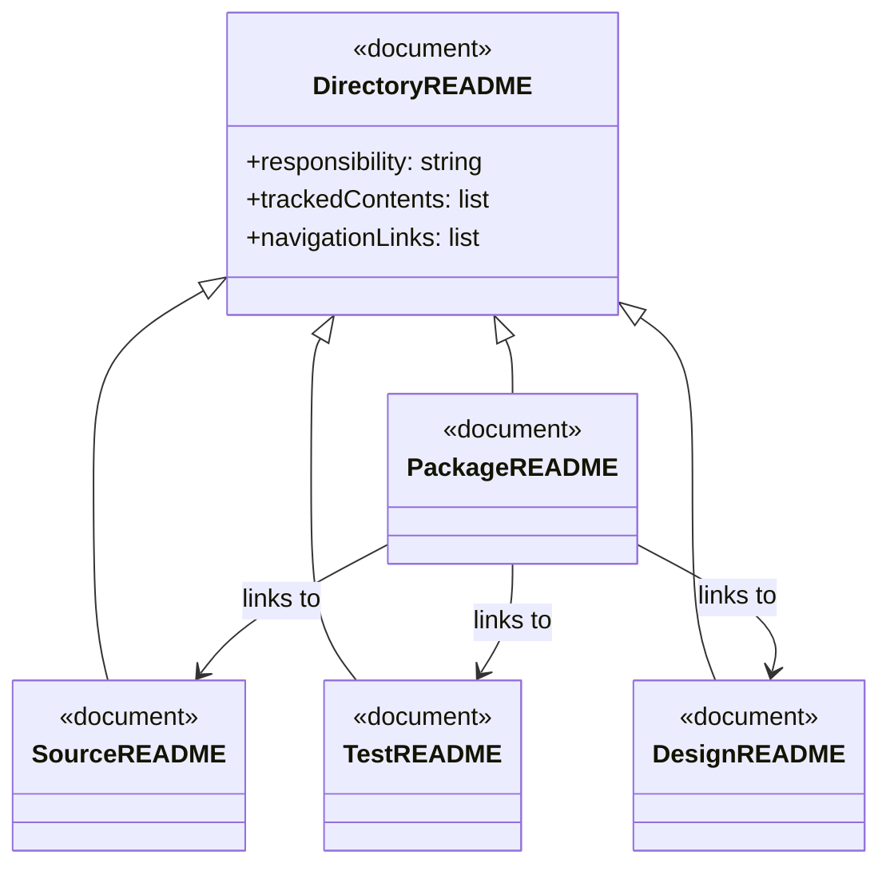
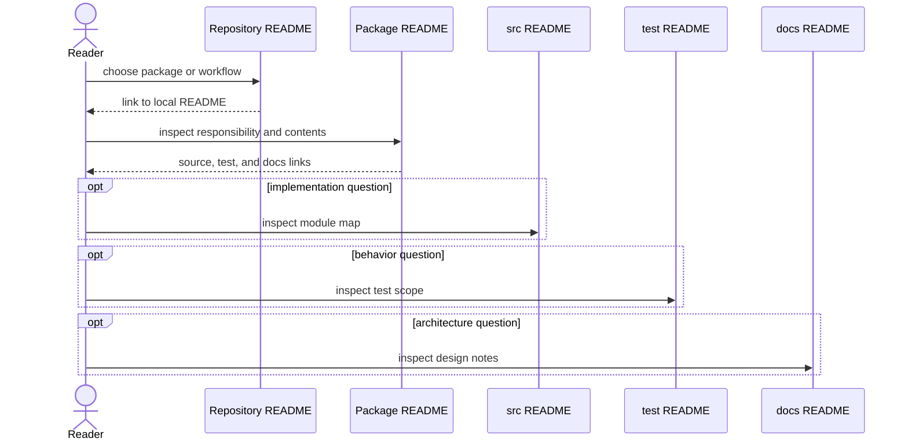

# Folder navigation documentation design

## Purpose

The repository README explains how to use bxios. The local READMEs added in this change form a navigation layer: each states a folder's responsibility, lists tracked direct contents, and links to the package, implementation, tests, design notes, or E2E context that answers the next question. Generated output and dependencies are intentionally outside this layer.

## High-level design

## Low-level design

## Class/interface model

## Navigation sequence

## Maintenance rule

When a tracked direct file or meaningful direct subdirectory is added, renamed, or removed, update that folder's README in the same change. Keep generated outputs and dependency directories out of this navigation layer.
