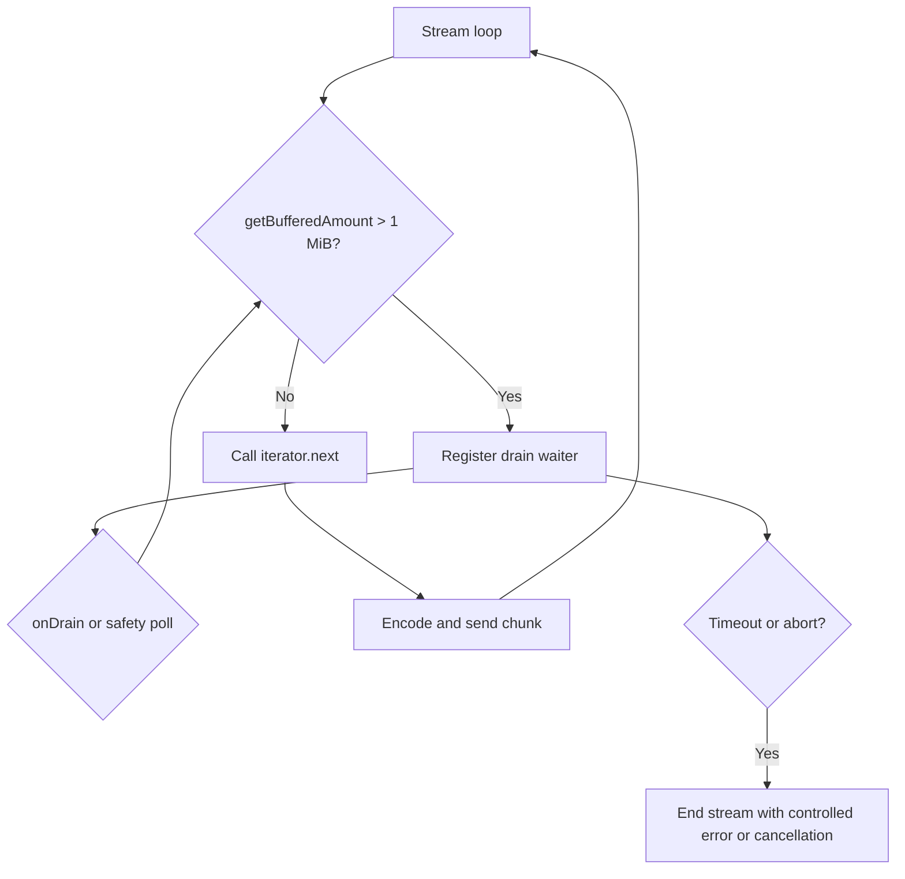
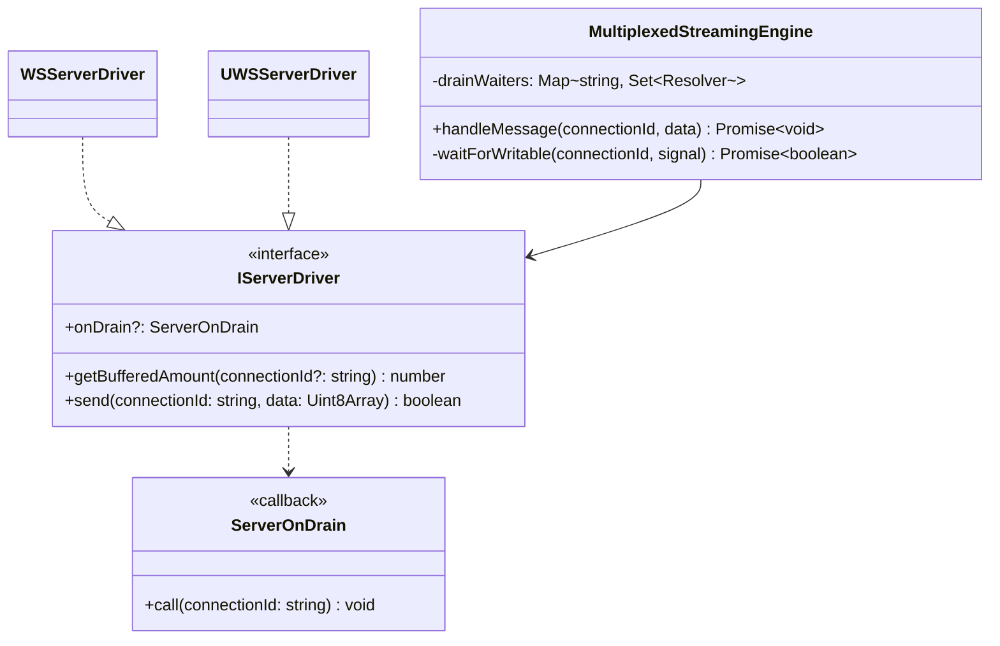
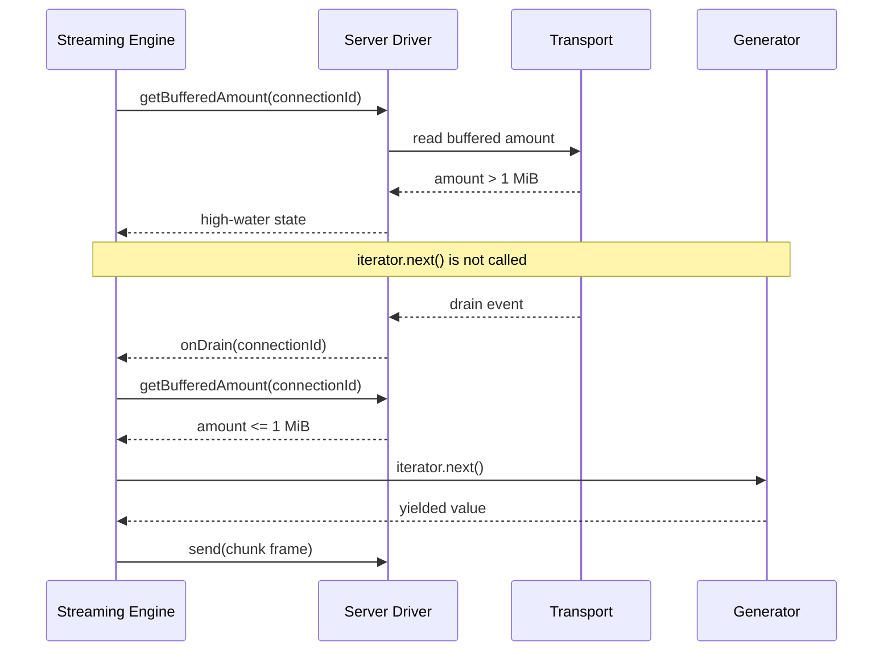

# Issue #10: Dynamic Backpressure & Drain Control

The server streaming engine now gates iterator advancement on the per-connection transport buffer. The default high-water threshold is 1 MiB. When the buffer exceeds it, the engine does not call the generator's `next()` method; it resumes as soon as the driver emits `onDrain`, with the existing bounded polling and timeout retained as a safety fallback.

## HLD

```mermaid
graph TD
    Client[Streaming Client] --> Driver[IServerDriver]
    Driver --> Transport[WebSocket or uWebSockets Transport]
    Driver --> Engine[MultiplexedStreamingEngine]
    Engine --> Generator[Server Async Generator]
    Engine --> BufferGate[Per-connection buffer gate]
    Transport -->|getBufferedAmount| BufferGate
    Transport -->|onDrain(connectionId)| BufferGate
    BufferGate -->|writable| Generator
```

## LLD



## Class and interface diagram



## Sequence diagram


