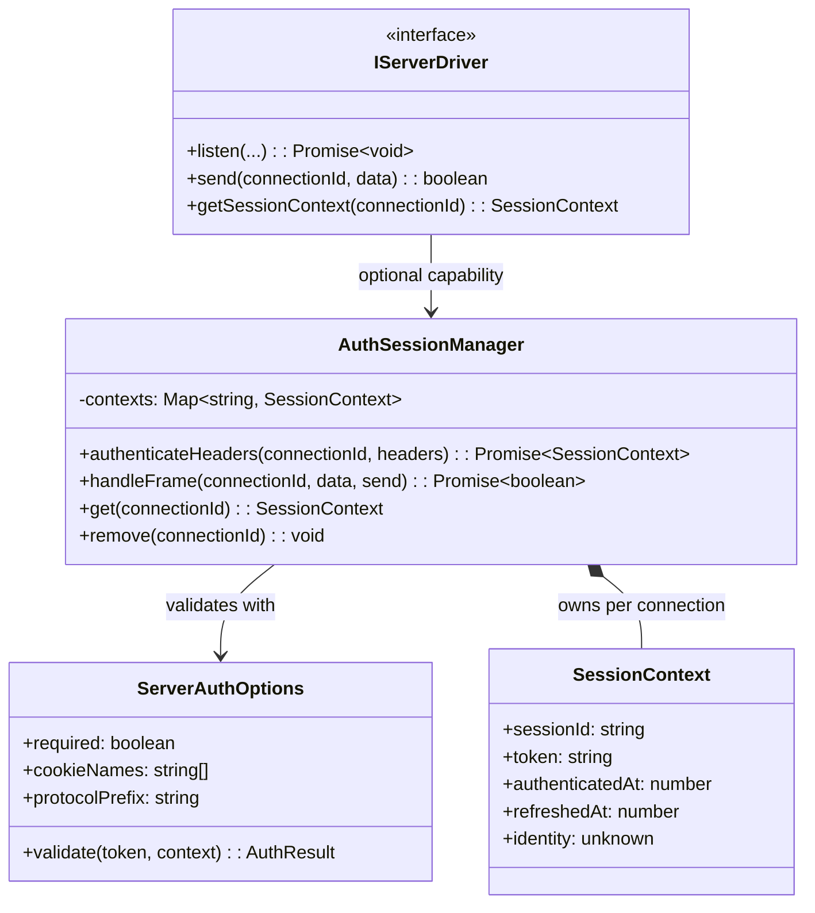
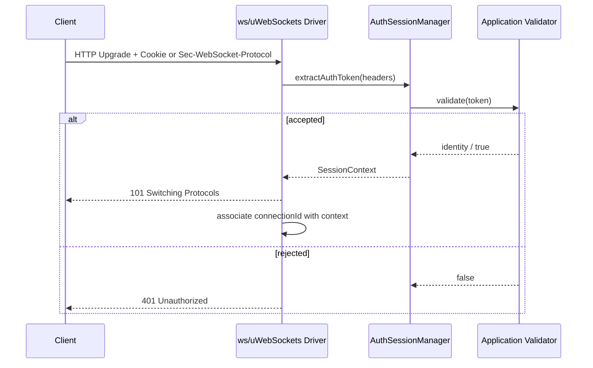

# Issue #11: Handshake Auth & Periodic `AUTH_REFRESH`

Authentication is an optional capability of the server drivers. When configured, the HTTP upgrade request is authenticated from a named Cookie (default names include `session`, `token`, and `bxios_session`) or a `Sec-WebSocket-Protocol` token. The resulting `SessionContext` is attached to the connection ID and remains the same object while tokens are refreshed.

## Class and interface



## Sequence: initial handshake



## High-level design

```mermaid
graph TD
    Upgrade[WebSocket Upgrade] --> Extract[Cookie / subprotocol token extraction]
    Extract --> Validate[Configured validate(token, context)]
    Validate -->|accepted| Context[Persistent SessionContext]
    Validate -->|rejected| Deny[Reject upgrade with 401]
    Context --> Socket[connectionId -> context]
    Socket --> Messages[Existing message and streaming handlers]
    Messages --> Refresh[FrameType.Auth / AUTH_REFRESH]
    Refresh --> Validate
    Refresh -->|accepted| Ack[FrameType.Auth code 200, same socket]
    Refresh -->|rejected| Error[FrameType.Auth code 401; retain current context]
```

## Low-level design: type-5 refresh

```mermaid
flowchart TD
    A[Incoming binary frame] --> B[decodeFrame]
    B --> C{frame.type == Auth?}
    C -->|no| D[Pass to existing onMessage pipeline]
    C -->|yes| E[Decode data: { token } or token]
    E --> F[Lookup current connection context]
    F --> G[validate new token, current context]
    G -->|accepted| H[Mutate same context token, refreshedAt, identity]
    H --> I[Send type 5 acknowledgement, code 200]
    G -->|rejected / malformed| J[Send type 5 error, code 401]
    I --> K[Socket remains open]
    J --> K
```

Refresh processing is internal to both server drivers and does not close the WebSocket. Applications can read the current context through `getSessionContext(connectionId)` and observe successful authentication through `onAuthenticated`.
