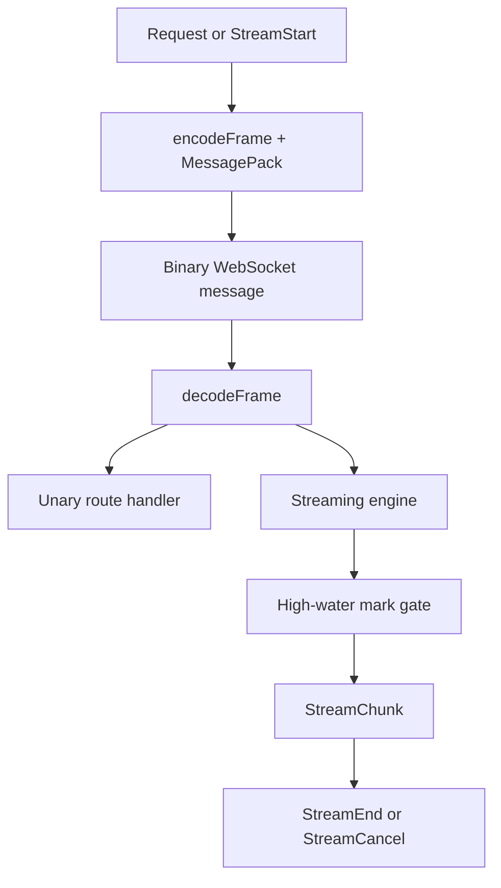
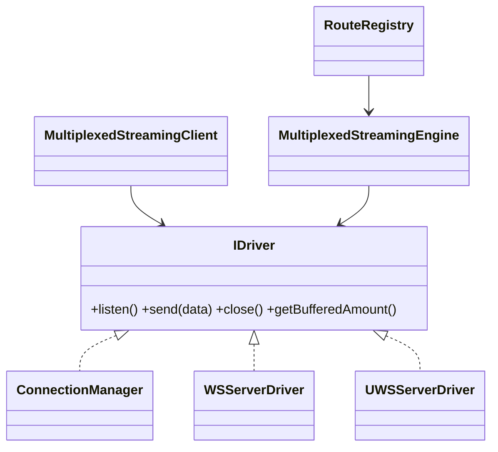
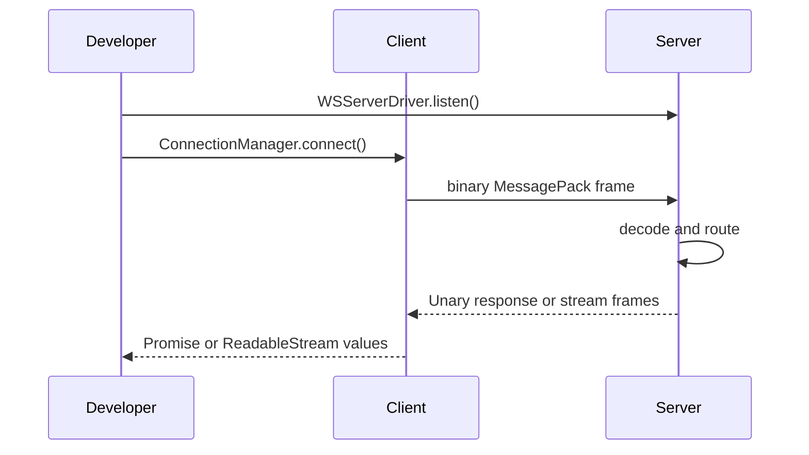

# README documentation design

The README mirrors the actual package entrypoints and the verified E2E/example workflow. It describes the current workspace state without implying an npm release.

## High-level information flow

```mermaid
flowchart LR
  Developer[Developer checkout] --> Workspace[pnpm workspace]
  Workspace --> Wire[@bxios/wire]
  Workspace --> Client[@bxios/bxios]
  Workspace --> Server[@bxios/server]
  Client <--> Transport[WebSocket transport]
  Transport <--> Server
```

## Low-level protocol flow



## Class/interface design



## Quick-start sequence


