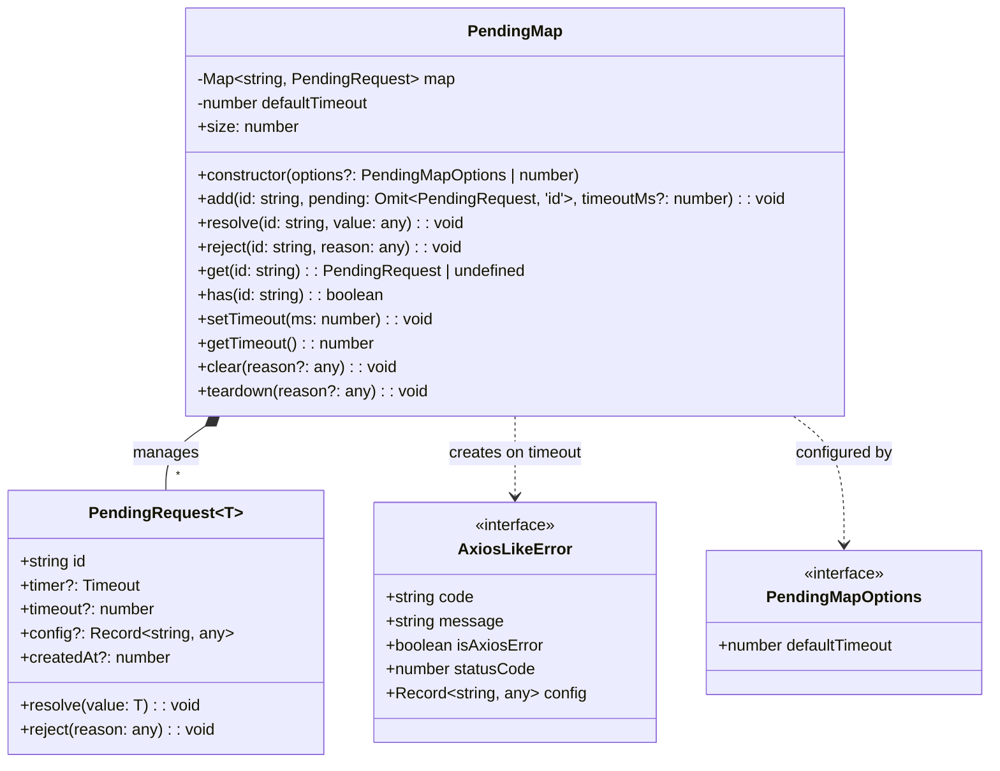
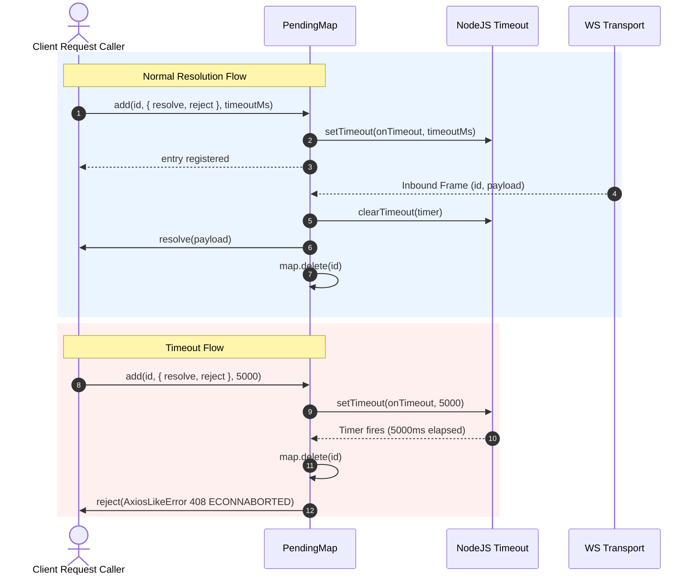
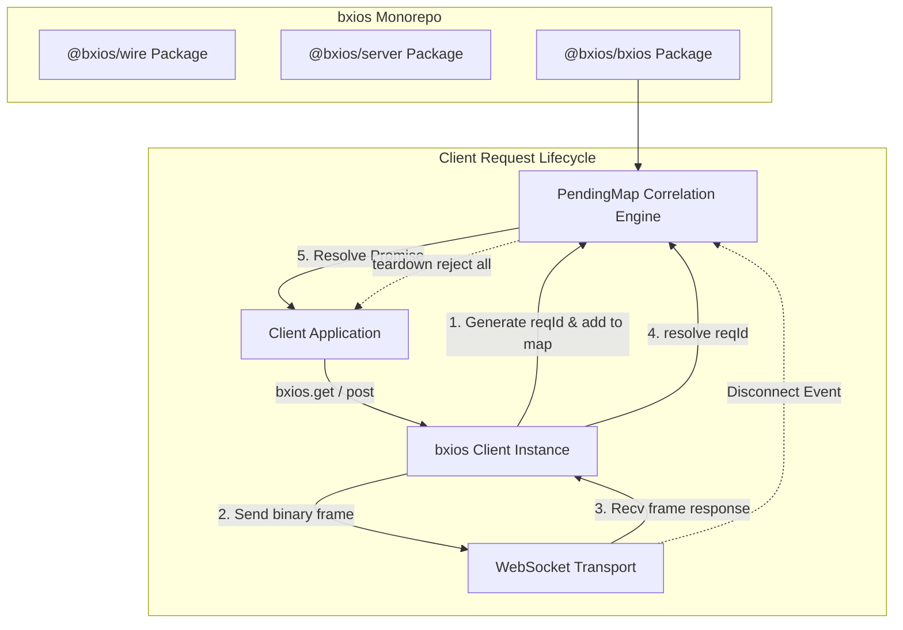
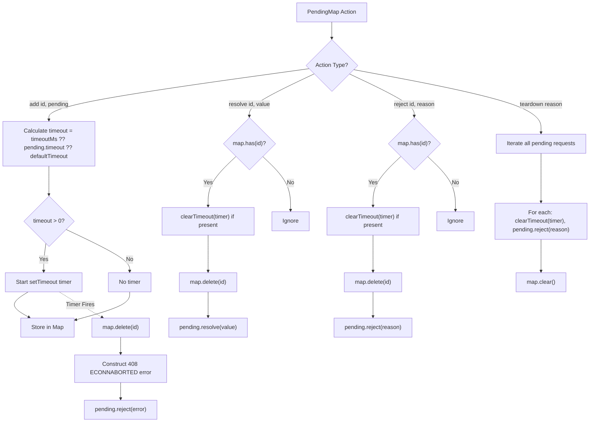

# @bxios/bxios PendingMap Correlation Engine Design

## Overview
`@bxios/bxios` provides the core correlation state machine for mapping asynchronous WebSocket responses back to their original caller Promises via `PendingMap`.

---

## 1. Class & Interface Diagram

---

## 2. Sequence Diagram: Request Lifecycle & Timeout Handling

---

## 3. High-Level Design (HLD): Monorepo Position & Request Lifecycle

---

## 4. Low-Level Design (LLD): Internal Flow & Disconnect Cleanup

