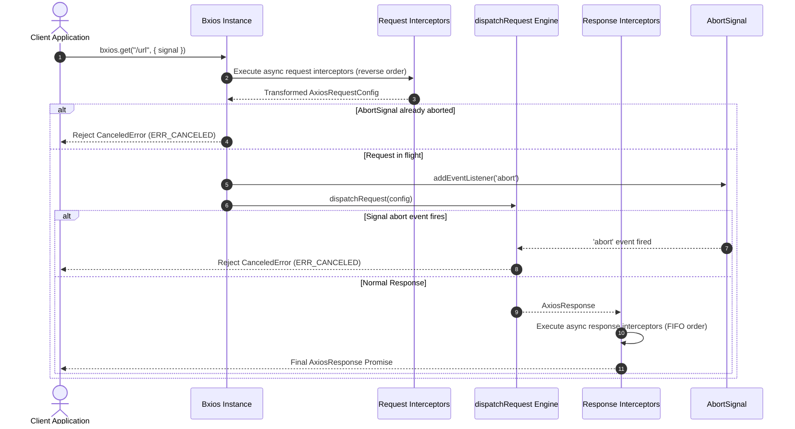
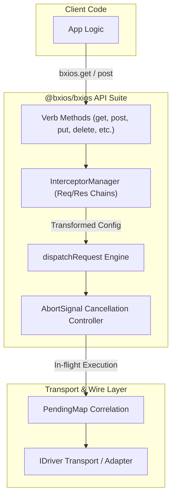
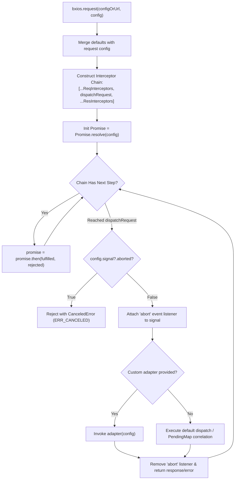

# Axios-compatible Method Suite & Interceptors Design Document

## Overview
`@bxios/bxios` provides an Axios-compatible API suite (`get`, `post`, `put`, `delete`, `patch`, `head`, `options`), request and response interceptors via `InterceptorManager`, and standard W3C `AbortSignal` request cancellation.

---

## 1. Class & Interface Diagram

```mermaid
classDiagram
    class AxiosRequestConfig~D~ {
        <<interface>>
        +string url
        +string method
        +string baseURL
        +Record~string, string~ headers
        +Record~string, any~ params
        +D data
        +number timeout
        +AbortSignal signal
        +adapter?: Function
    }

    class AxiosResponse~T, D~ {
        <<interface>>
        +T data
        +number status
        +string statusText
        +Record~string, string~ headers
        +AxiosRequestConfig~D~ config
    }

    class InterceptorHandler~T~ {
        <<interface>>
        +InterceptorFulfilled~T~ fulfilled
        +InterceptorRejected rejected
        +boolean synchronous
        +runWhen?: Function
    }

    class InterceptorManager~V~ {
        -Array~InterceptorHandler~V~ | null~ handlers
        +use(fulfilled, rejected, options): number
        +eject(id: number): void
        +clear(): void
        +forEach(fn): void
        +length: number
    }

    class Bxios {
        +AxiosRequestConfig defaults
        +interceptors: { request, response }
        +dispatchRequest(config): Promise~AxiosResponse~
        +request(configOrUrl, config): Promise~R~
        +get(url, config): Promise~R~
        +post(url, data, config): Promise~R~
        +put(url, data, config): Promise~R~
        +delete(url, config): Promise~R~
        +patch(url, data, config): Promise~R~
        +head(url, config): Promise~R~
        +options(url, config): Promise~R~
    }

    Bxios *-- InterceptorManager : request & response interceptors
    InterceptorManager *-- InterceptorHandler : stores
    Bxios ..> AxiosRequestConfig : consumes
    Bxios ..> AxiosResponse : produces
```

---

## 2. Sequence Diagram: Interceptors, Dispatch & AbortSignal



---

## 3. High-Level Design (HLD): API Suite Architecture



---

## 4. Low-Level Design (LLD): Interceptor Chain & Cancellation Flowchart


