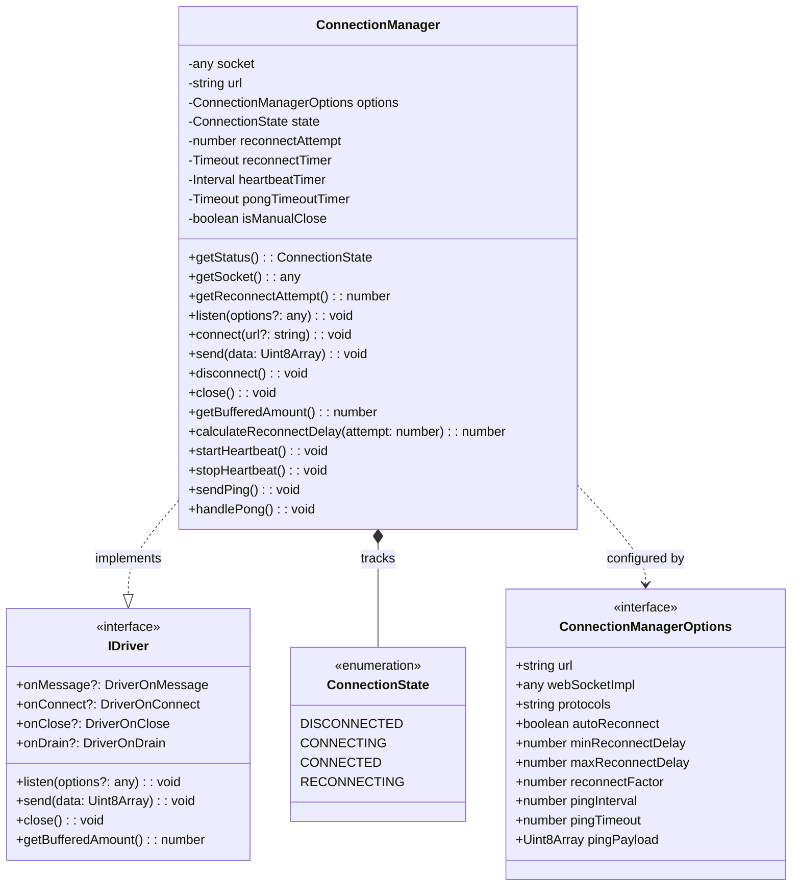
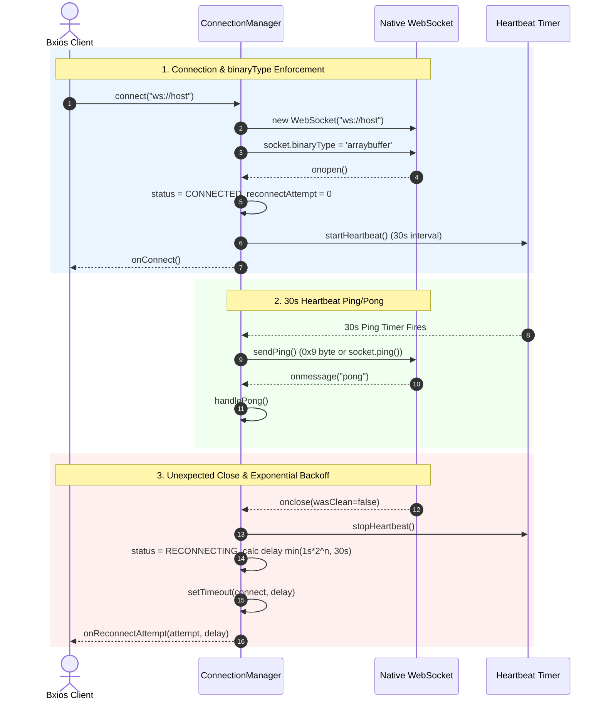
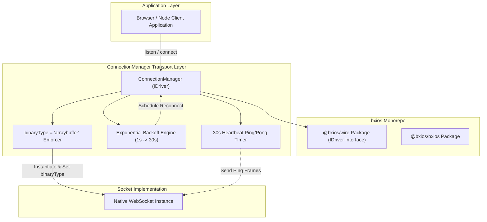
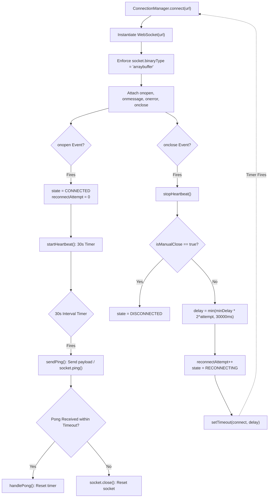

# ConnectionManager Design Document

## Overview
`ConnectionManager` provides isomorphic WebSocket socket lifecycle management across Browser and Node environments for `@bxios/bxios`. It implements the `IDriver` interface from `@bxios/wire` and provides automatic exponential backoff reconnection and a 30-second ping/pong heartbeat timer.

---

## 1. Class & Interface Diagram

---

## 2. Sequence Diagram: Lifecycle, Heartbeat & Reconnection

---

## 3. High-Level Design (HLD): Monorepo Transport Position

---

## 4. Low-Level Design (LLD): Flowchart & State Machine

