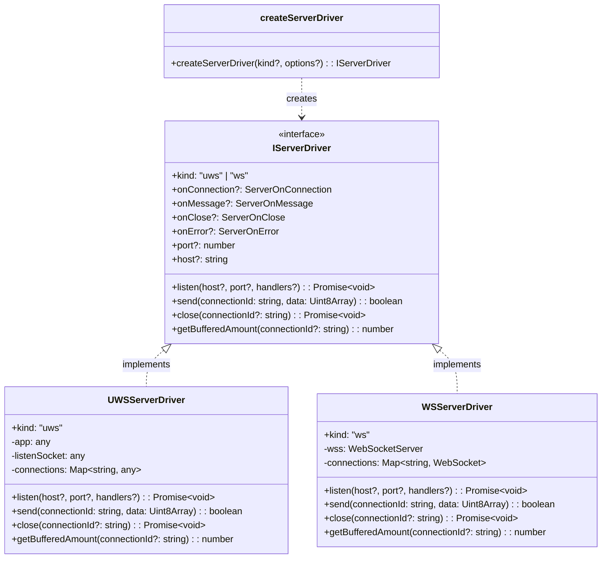
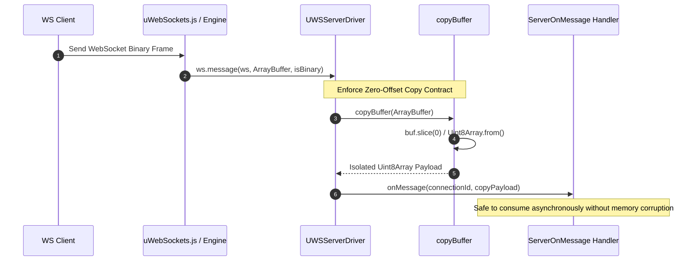
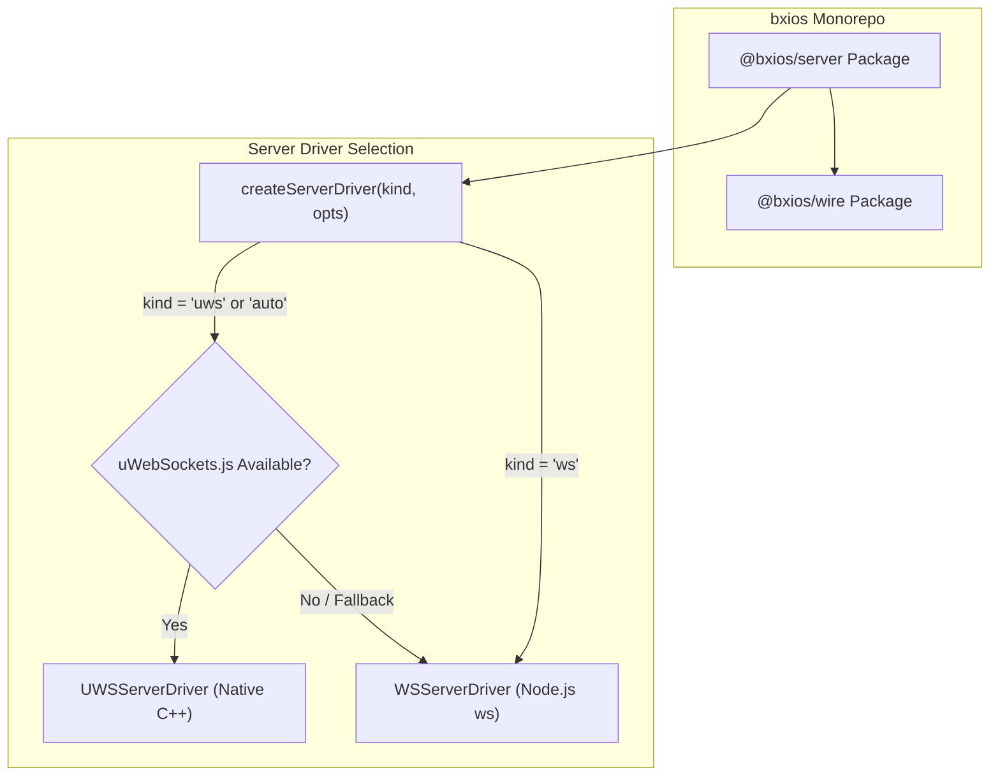
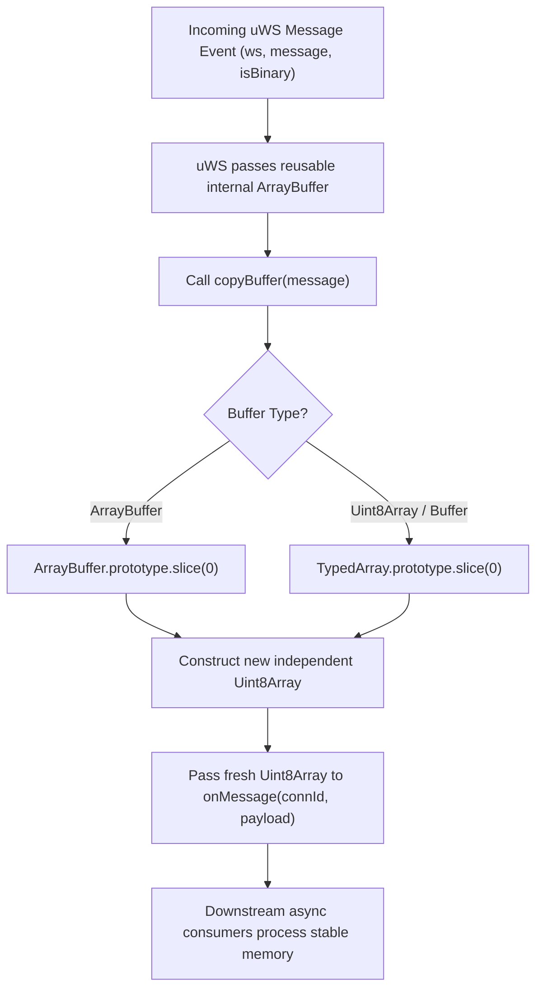

# @bxios/server Design & Architecture

## Overview
`@bxios/server` provides a unified, high-performance server-side WebSocket driver abstraction for the `bxios` REST-over-WebSocket library.

It supports two concrete driver implementations:
1. `UWSServerDriver` (`uwsDriver`): Native high-performance binding wrapping `uWebSockets.js`.
2. `WSServerDriver` (`wsDriver`): Pure JavaScript fallback driver wrapping the Node.js `ws` library for environments without native C++ build tools.

---

## 1. Class & Interface Diagram

---

## 2. Sequence Diagram: Message Receiving & Buffer Copy Contract

`uWebSockets.js` reuses internal `ArrayBuffer` memory allocations across incoming message callbacks. To prevent memory corruption or race conditions where downstream handlers process mutated memory asynchronously, `@bxios/server` executes a mandatory zero-offset memory copy (`buf.slice(0)` / `copyBuffer`) BEFORE passing payloads to subscriber callbacks.

---

## 3. High-Level Design (HLD): Monorepo Position & Auto-Selection

---

## 4. Low-Level Design (LLD): Memory Copy Safeguard Flow

