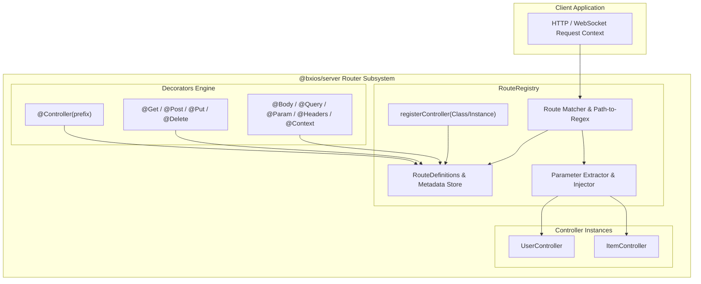
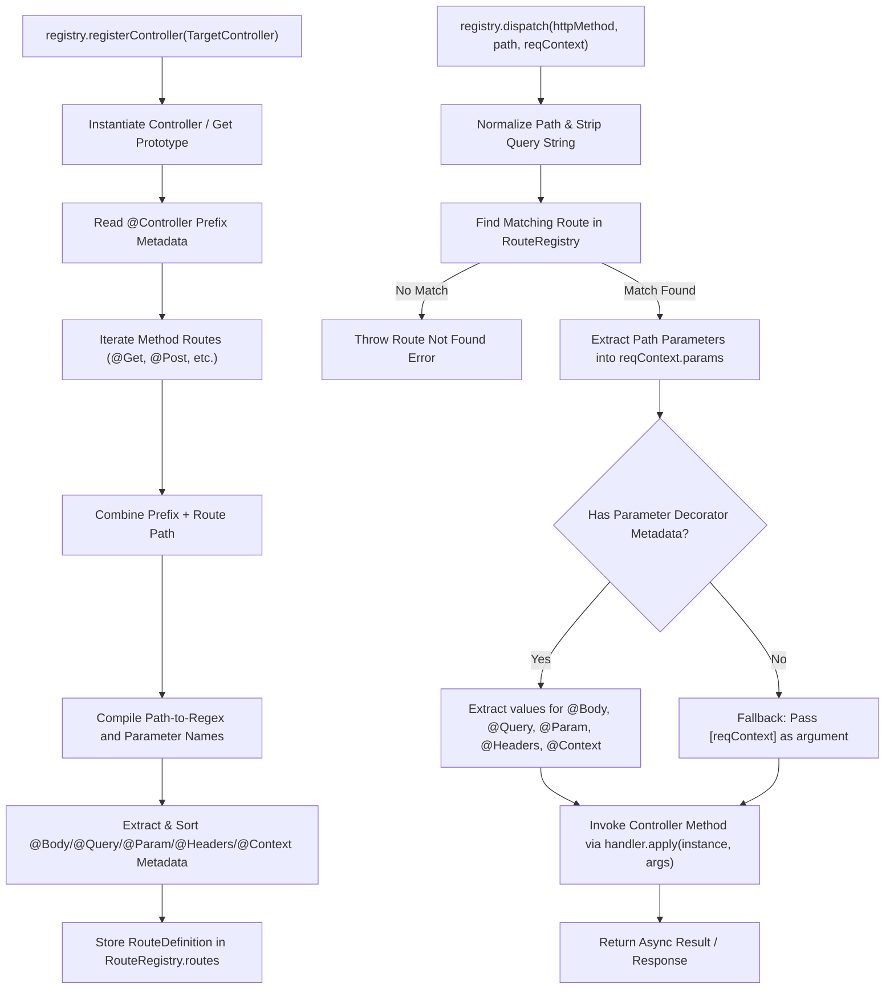
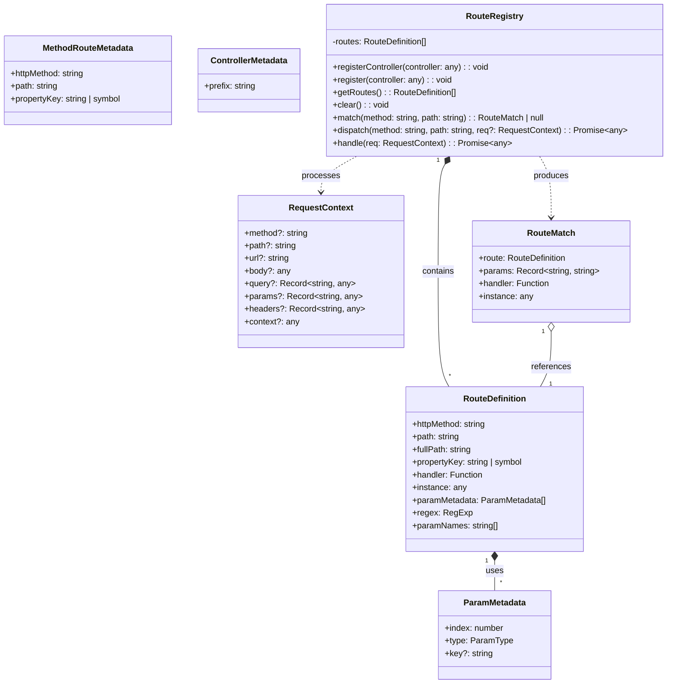
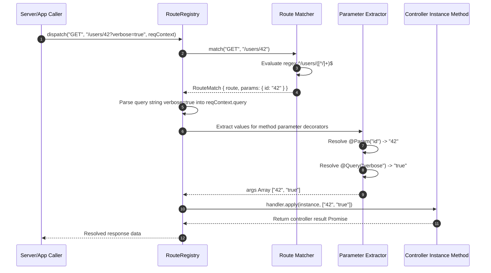

# Issue #7 Design: Decorator Router & Parameter Injection for `@bxios/server`

## Executive Summary
This design document details the architecture and implementation of the decorator-based router and parameter injection engine in `@bxios/server`.

The system introduces standard TypeScript class (`@Controller`), method (`@Get`, `@Post`, `@Put`, `@Delete`, `@Patch`), and parameter (`@Body`, `@Query`, `@Param`, `@Headers`, `@Context`) decorators, alongside a high-performance `RouteRegistry` for dynamic route compilation, parameter extraction, and request dispatching.

---

## 1. High-Level Design (HLD)

---

## 2. Low-Level Design (LLD)

---

## 3. Class & Interface Diagram

---

## 4. Sequence Diagram

