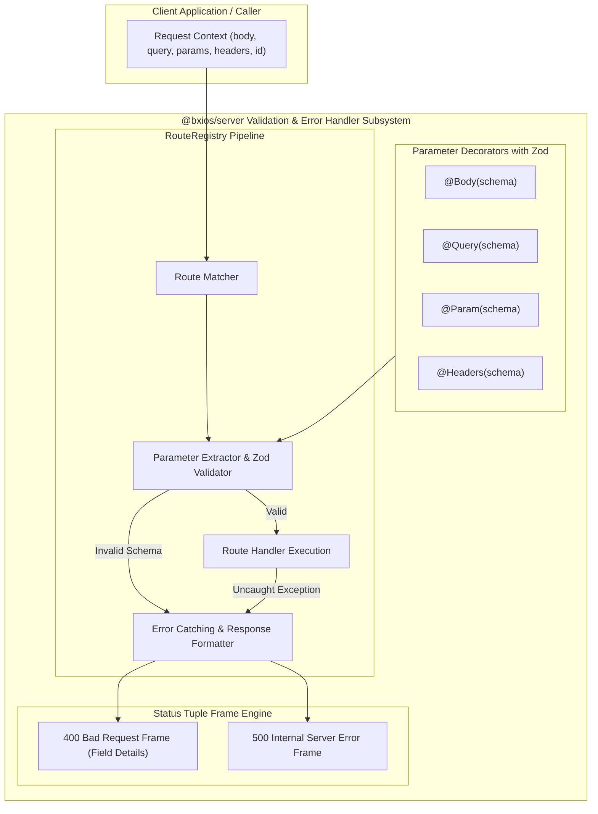
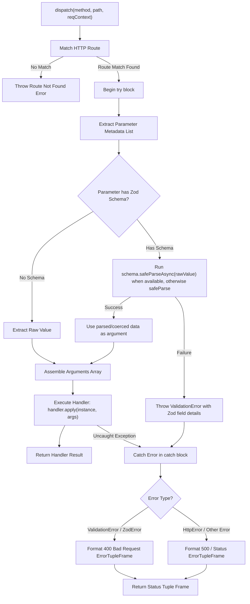
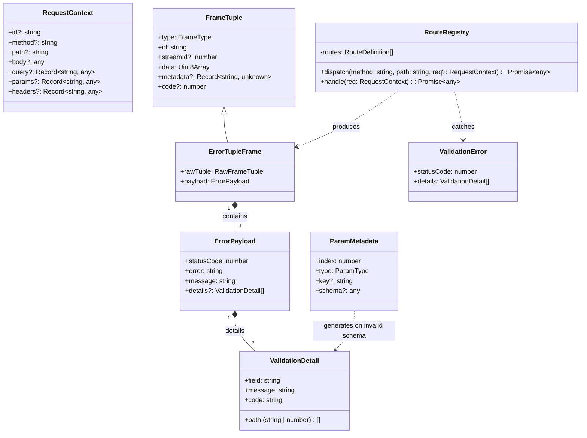
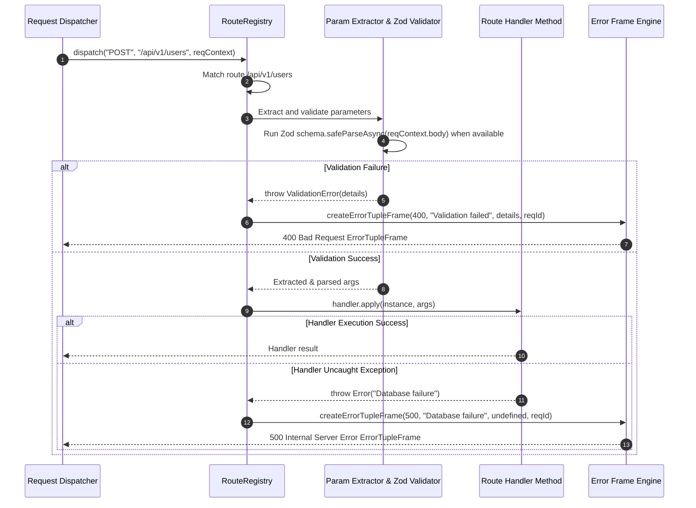

# Issue #8 Design: Zod Validation & Error Handler Middleware for `@bxios/server`

## Executive Summary
This design document details the architecture and implementation of Zod schema validation and error handling middleware for `@bxios/server`.

The system integrates Zod schema parsing into method parameter injection decorators (`@Body`, `@Query`, `@Param`, `@Headers`, `@Context`), returning a 400 Bad Request status tuple frame with field-level validation details upon validation failure, and catching uncaught route exceptions to format them into standard 500 Internal Server Error status tuple frames compatible with `@bxios/wire`.

---

## 1. High-Level Design (HLD)

---

## 2. Low-Level Design (LLD)

---

## 3. Class & Interface Diagram

---

## 4. Sequence Diagram

