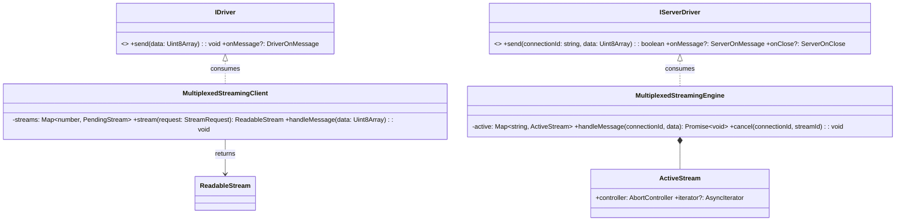
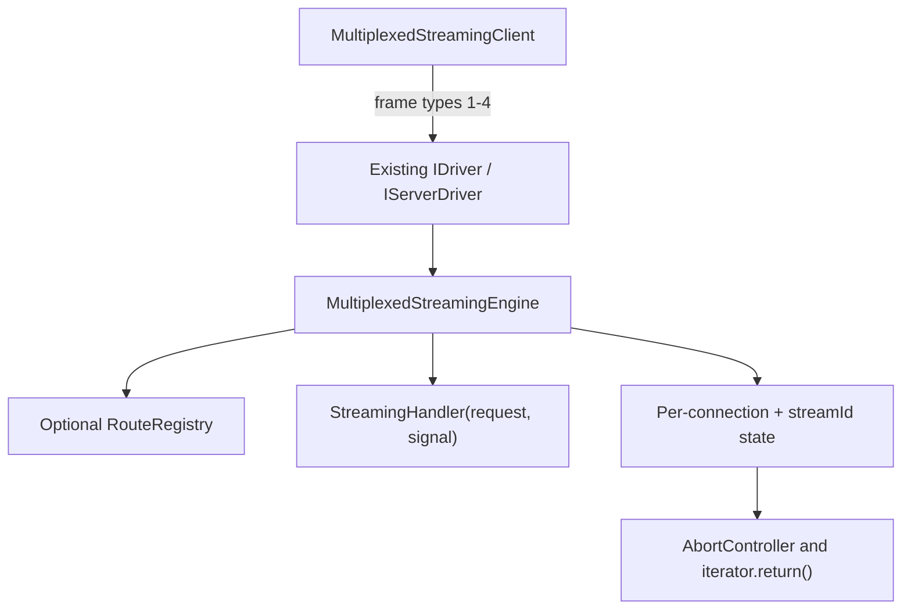
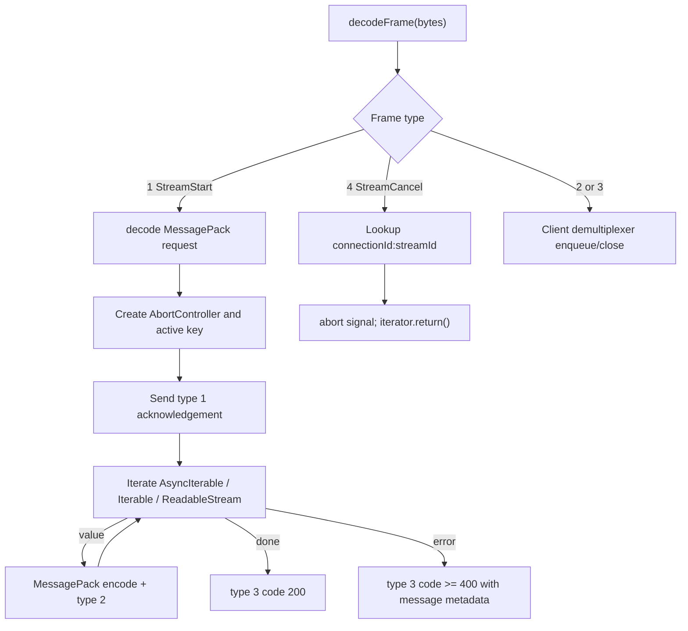

# Issue #9 Design: Multiplexed Streaming Engine

The engine layers stream lifecycle handling over the existing WebSocket drivers and wire tuple codec. A client allocates a local stream ID and sends frame type 1. The server acknowledges the stream, forwards MessagePack-encoded values as frame type 2, and terminates with frame type 3. A client `ReadableStream.cancel()` sends frame type 4; the server aborts the associated `AbortController` and calls the iterator's `return()` hook.

## Class and interface diagram



## Sequence diagram

```mermaid
sequenceDiagram
    participant App as Client App
    participant Client as Streaming Client
    participant WS as WebSocket Driver
    participant Server as Streaming Engine
    participant Gen as Server Generator
    App->>Client: stream(request)
    Client->>WS: frameType 1 (streamId, request)
    WS->>Server: onMessage(connectionId, bytes)
    Server->>Gen: invoke(request, AbortSignal)
    Server-->>WS: frameType 1 acknowledgement
    WS-->>Client: frameType 1
    loop each yielded value
        Gen-->>Server: value
        Server-->>Client: frameType 2 chunk
        Client->>App: ReadableStream.enqueue(value)
    end
    Server-->>Client: frameType 3 closure
    App->>Client: reader.cancel(reason)
    Client-->>Server: frameType 4 cancellation
    Server->>Gen: AbortSignal.abort(); iterator.return()
```

## High-level design



## Low-level design


