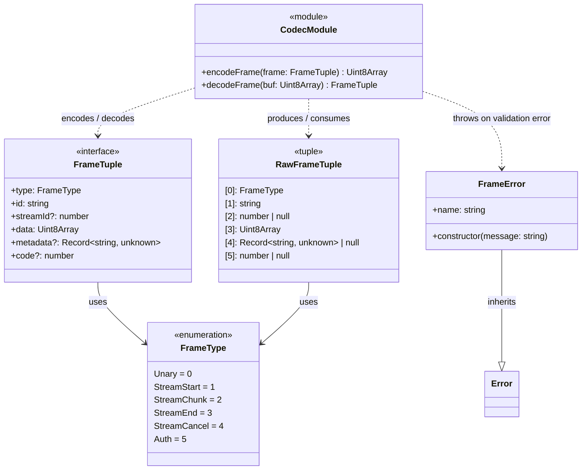
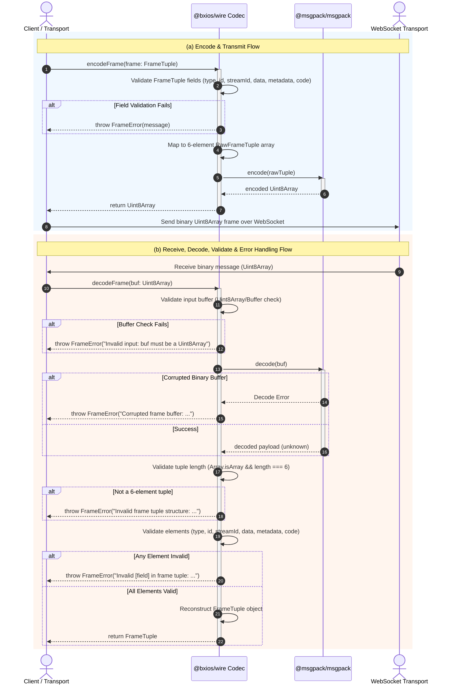

# Issue #1 Design Document: MessagePack Frame Codec & FrameType Specs

This document specifies the design and implementation details for `@bxios/wire` Frame Specification and MessagePack Codec, implementing issue #1 for the `bxios` monorepo.

---

## 1. High-Level Design (HLD)

The `@bxios/wire` package serves as the core wire protocol layer in the `bxios` REST-over-WebSocket stack. It defines the binary message layout, frame types, and codec utilities required for bi-directional communication between bxios client and server instances.

### Monorepo & Architectural Context

```mermaid
graph TD
    subgraph Monorepo ["bxios Monorepo"]
        subgraph AppLayer ["Application / API Layer"]
            Client ["bxios Client"]
            Server ["bxios Server"]
        end

        subgraph TransportLayer ["Transport & RPC Layer"]
            WS ["WebSocket Transport"]
            RPC ["REST / RPC Manager"]
        end

        subgraph WireLayer ["Wire Protocol Layer (@bxios/wire)"]
            Codec ["MessagePack Codec\n(encodeFrame / decodeFrame)"]
            Types ["Frame Specifications\n(FrameType, FrameTuple, RawFrameTuple)"]
            Errors ["FrameError Class"]
        end
    end

    subgraph Network ["Network Layer"]
        WSConn ["WebSocket Connection\n(Binary MessagePack Stream)"]
    end

    Client --> RPC
    Server --> RPC
    RPC --> WS
    WS --> Codec
    Codec --> Types
    Codec --> Errors
    Codec <--> WSConn
```

---

## 2. Low-Level Design (LLD)

The codec module (`packages/wire/src/codec.ts`) handles serialization and deserialization between high-level `FrameTuple` TypeScript objects and compact binary MessagePack byte arrays (`Uint8Array`). 

### Tuple Layout (6 Elements)
To minimize payload overhead over the wire, frames are represented as a fixed 6-element tuple (`RawFrameTuple`):
`[type, id, streamId, data, metadata, code]`

- Index 0: `type` - `FrameType` enum (0 to 5)
- Index 1: `id` - Non-empty string frame identifier
- Index 2: `streamId` - `number | null` (optional stream identifier)
- Index 3: `data` - `Uint8Array` binary payload
- Index 4: `metadata` - `Record<string, unknown> | null` (optional header/metadata object)
- Index 5: `code` - `number | null` (optional status or error code)

### Validation & Pipeline

```mermaid
flowchart TD
    subgraph EncodePipeline ["encodeFrame Validation & Encoding Pipeline"]
        E1["Input: frame (FrameTuple)"] --> E2{"Validate Object Structure"}
        E2 -- Invalid --> EE["Throw FrameError"]
        E2 -- Valid --> E3{"Validate FrameType (0..5)"}
        E3 -- Invalid --> EE
        E3 -- Valid --> E4{"Validate id (non-empty string)"}
        E4 -- Invalid --> EE
        E4 -- Valid --> E5{"Validate streamId (optional number)"}
        E5 -- Invalid --> EE
        E5 -- Valid --> E6{"Validate data (Uint8Array / Buffer)"}
        E6 -- Invalid --> EE
        E6 -- Valid --> E7{"Validate metadata (optional object)"}
        E7 -- Invalid --> EE
        E7 -- Valid --> E8{"Validate code (optional number)"}
        E8 -- Invalid --> EE
        E8 -- Valid --> E9["Construct 6-element RawFrameTuple:\n[type, id, streamId??null, dataBytes, metadata??null, code??null]"]
        E9 --> E10["@msgpack/msgpack encode(tuple)"]
        E10 -- Success --> E11["Output: Uint8Array"]
        E10 -- Error --> EE
    end

    subgraph DecodePipeline ["decodeFrame Decoding & Validation Pipeline"]
        D1["Input: buf (Uint8Array)"] --> D2{"Validate Input Buffer"}
        D2 -- Invalid --> DE["Throw FrameError"]
        D2 -- Valid --> D3["@msgpack/msgpack decode(buf)"]
        D3 -- Corrupted Buffer --> DE
        D3 -- Success --> D4{"Validate 6-element Array Tuple"}
        D4 -- Invalid Length/Type --> DE
        D4 -- Valid --> D5{"Validate Tuple Elements:\n- type: int [0..5]\n- id: non-empty string\n- streamId: number | null\n- data: Uint8Array\n- metadata: object | null\n- code: number | null"}
        D5 -- Invalid Element --> DE
        D5 -- Valid --> D6["Construct FrameTuple object\n(omit null/undefined optional fields)"]
        D6 --> D7["Output: FrameTuple"]
    end
```



---

## 3. Class & Interface Diagram

The components in `@bxios/wire` comprise the `FrameType` enum, the `FrameTuple` interface, the `RawFrameTuple` tuple type, the custom `FrameError` exception, and the codec module functions (`encodeFrame`, `decodeFrame`).



---

## 4. Sequence Diagram

The interaction flow details both frame encoding prior to WebSocket transmission, and frame decoding & validation upon receiving binary messages over the wire.


