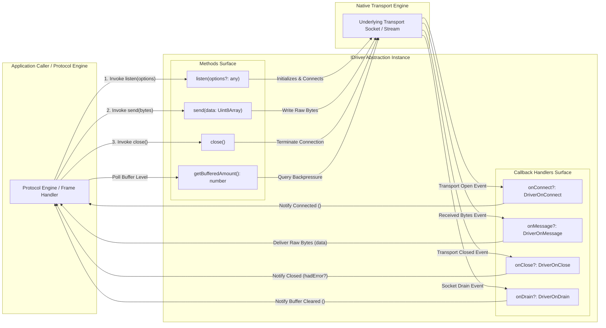
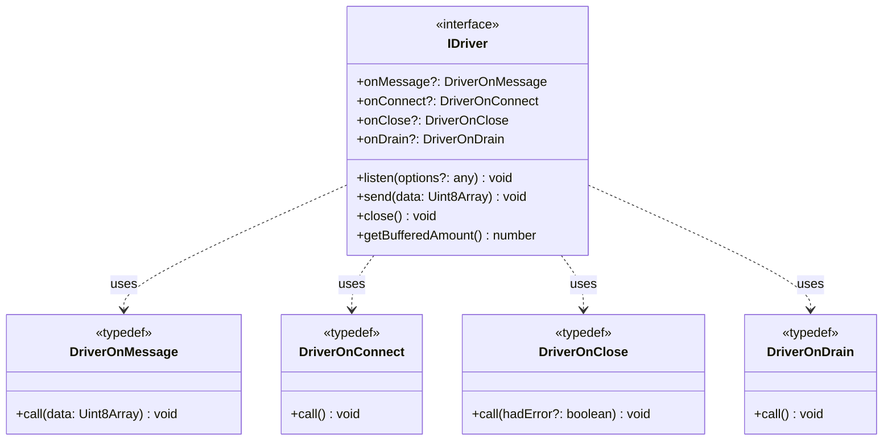
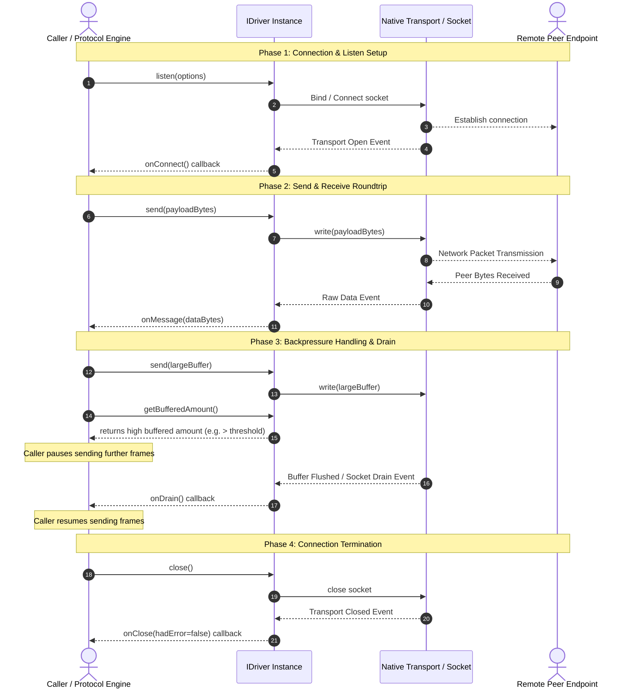

# Issue #2: Universal IDriver Abstraction Layer Design Document

## Overview

The `@bxios/wire` package defines the core wire-protocol structures and transport abstractions used across `bxios`. Issue #2 establishes the `IDriver` interface and its associated callback types (`DriverOnMessage`, `DriverOnConnect`, `DriverOnClose`, `DriverOnDrain`), serving as the transport-agnostic interface layer for framed binary communication over various underlying networks (WebSockets, TCP sockets, in-memory channels, etc.).

---

## 1. High-Level Design (HLD)

The `IDriver` interface decouples higher-level protocol components (such as frame serialization via `FrameType`/`FrameTuple` and session management) from platform-specific network transports. Concrete transport implementations (e.g., WebSocket or TCP drivers in Issue #3) implement `IDriver` to provide transport operations.

```mermaid
graph TD
    subgraph Bxios Client/Server Application Layer
        Client["bxios Client / Server Session Manager"]
    end

    subgraph Package @bxios/wire
        Codec["Frame Codec<br/>(encodeFrame / decodeFrame)"]
        IDriver["IDriver Abstraction Interface<br/>(listen, send, close, getBufferedAmount)"]
        Types["Wire Types<br/>(FrameType, FrameTuple)"]
    end

    subgraph Future Transport Drivers (Issue #3)
        WsDriver["WebSocketDriver / BunWsDriver<br/>(implements IDriver)"]
        TcpDriver["TcpDriver / NodeNetDriver<br/>(implements IDriver)"]
        MemoryDriver["InMemoryDriver / LoopbackDriver<br/>(implements IDriver)"]
    end

    subgraph Native Transport Connections
        WS["WebSocket Server / Client Socket"]
        TCP["Node.js net.Socket / Server"]
        Channel["In-Memory MessageChannel / Queue"]
    end

    Client --> Codec
    Client --> IDriver
    IDriver <|.. WsDriver
    IDriver <|.. TcpDriver
    IDriver <|.. MemoryDriver

    WsDriver --> WS
    TcpDriver --> TCP
    MemoryDriver --> Channel
```

---

## 2. Low-Level Design (LLD)

The `IDriver` surface consists of four core methods (`listen`, `send`, `close`, `getBufferedAmount`) and four optional event callbacks (`onMessage`, `onConnect`, `onClose`, `onDrain`). The LLD diagram illustrates how callers invoke methods on an `IDriver` instance and how event callbacks bridge low-level network events back to the caller.



---

## 3. Class / Interface Diagram

This diagram displays the exact TypeScript interfaces and callback types defined in `packages/wire/src/driver.ts`.



---

## 4. Sequence Diagram

The sequence diagram documents end-to-end send and receive workflows, connection lifecycle, and backpressure management using `getBufferedAmount()` and `onDrain()`.


